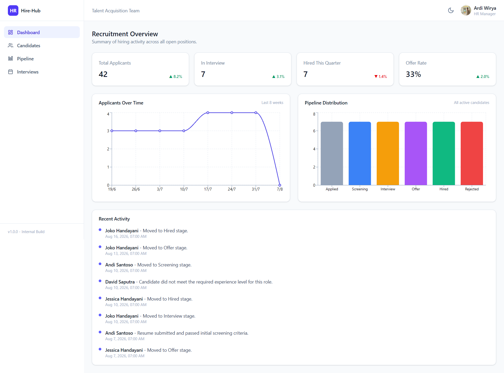
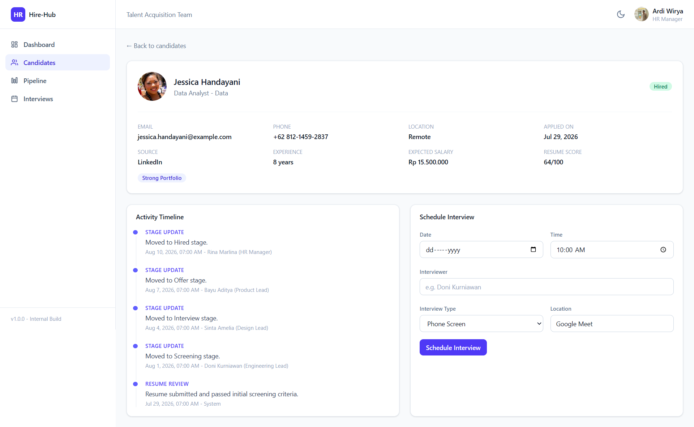
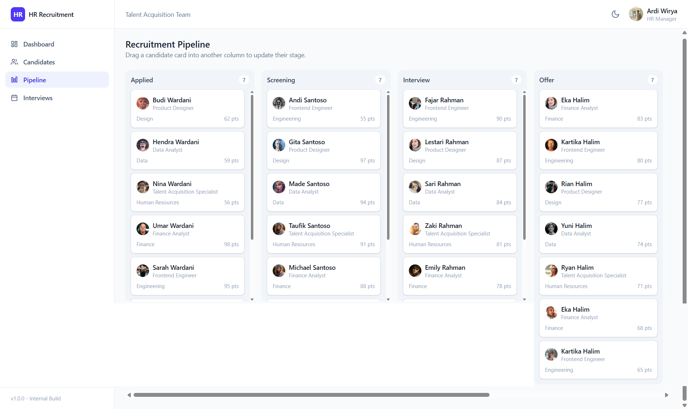

# Hire-Hub

A recruitment management dashboard built to explore how a modern HR platform such as Workday, Greenhouse, or Lever could be structured on the front end. The application covers the full hiring workflow: tracking applicants, moving candidates through recruitment stages, scheduling interviews, and reviewing pipeline metrics.

This is a front end only project. All data is generated in memory and resets on page reload, there is no backend or persistence layer.

Live Demo : [Hire-Hub](https://hirehub-react.vercel.app/)

## Preview

<p align="center">


<p align="center">


<p align="center">


## Features

- Dashboard with key recruitment metrics and charts (applicants over time, pipeline distribution)
- Candidate list with search, department and stage filters, and sorting
- Candidate detail page with profile information and an activity timeline
- Recruitment pipeline as a drag and drop Kanban board across six stages: Applied, Screening, Interview, Offer, Hired, Rejected
- Interview scheduling form with validation, built with React Hook Form
- Interview schedule page listing all upcoming interviews
- Dark mode with preference saved to local storage
- Fully responsive layout, including a mobile navigation drawer
- 40+ generated candidate records with realistic names, positions, and activity history

## Tech Stack

- [React 19](https://react.dev/) with [TypeScript](https://www.typescriptlang.org/)
- [Vite](https://vite.dev/) as the build tool
- [Tailwind CSS v4](https://tailwindcss.com/) for styling
- [Zustand](https://zustand.docs.pmnd.rs/) for state management
- [React Router](https://reactrouter.com/) for routing
- [React Hook Form](https://react-hook-form.com/) for form handling and validation
- [Recharts](https://recharts.org/) for data visualization
- [oxlint](https://oxc.rs/docs/guide/usage/linter.html) for linting

## Folder Structure

```
src/
  components/
    layout/            Sidebar, topbar, and the app shell
    ui/                 Small shared primitives (Button, Card, Badge)
    dashboard/          Stat cards, charts, and recent activity feed
    candidates/         Candidate table, filters, and status badge
    candidate-detail/   Profile, activity timeline, interview form
    pipeline/           Kanban board, columns, and cards
  data/                 Generated dummy data (candidates, interviews)
  hooks/                Derived state hooks (filtering, sorting)
  lib/                  Formatting and utility helpers
  pages/                Route level page components
  store/                Zustand stores (candidates, interviews, theme)
  types/                Shared TypeScript types
  App.tsx               Route definitions
  main.tsx              Application entry point
```

Each folder maps to one concern in the app. Components are kept small and colocated by feature rather than by type, so a change to the pipeline board only touches files inside `components/pipeline`.

## Installation

Requirements: Node.js 20 or later and npm.

```bash
git clone https://github.com/ardiwirya/hire-hub.git
cd hire-hub
npm install
npm run dev
```

The app runs at `http://localhost:5173` by default.

Other available scripts:

```bash
npm run build     # type check and build for production
npm run preview   # preview the production build locally
npm run lint       # run oxlint
```

## License

This project is licensed under the MIT License. See the [LICENSE](LICENSE) file for details.
